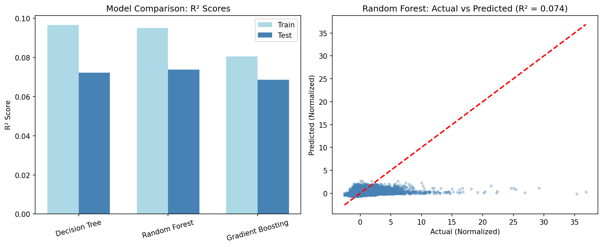
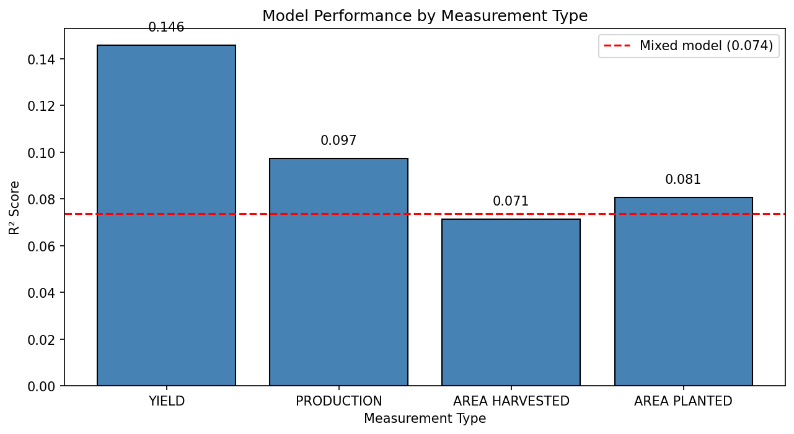
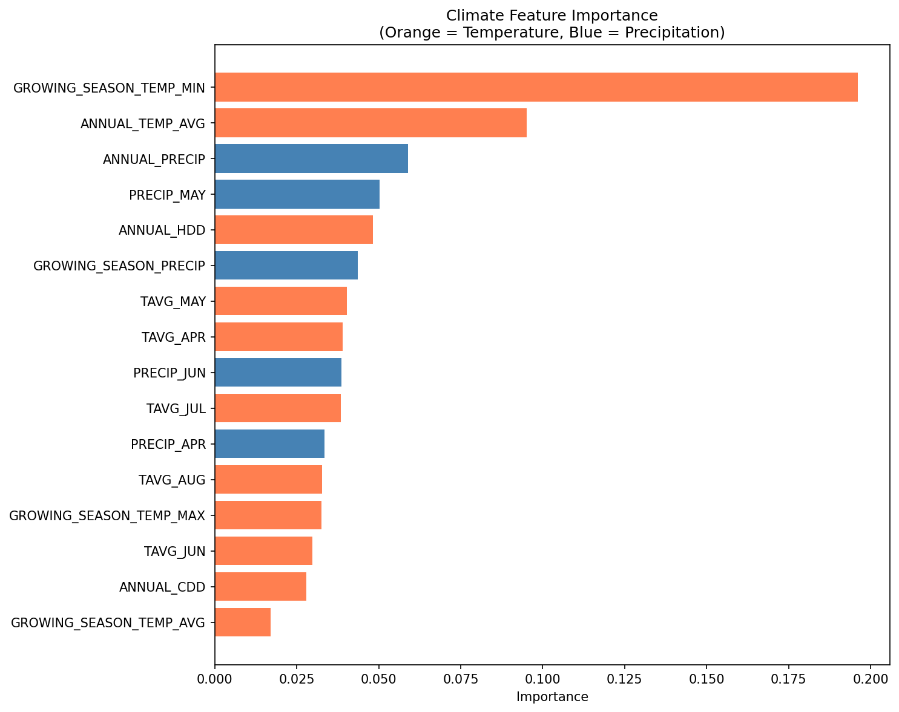
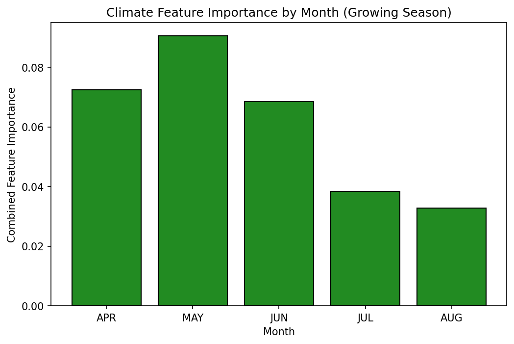
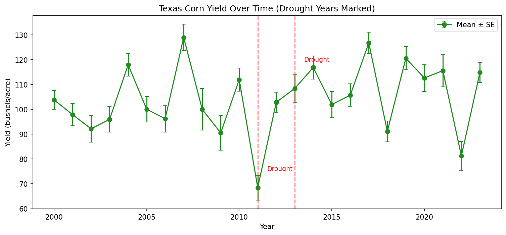
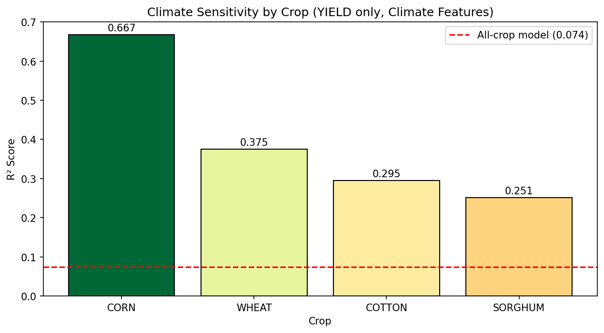

# Predicting Texas Agricultural Production Using Climate Data

## Final Report

**Team:** Carter Dobbs (dgi6), Johann Steinhoff (ngq7), Jay Suh (hkm55)  
**Course:** CS 4347 - Introduction to Machine Learning  
**December 6, 2025**

---

## Abstract

This project develops regression models to predict agricultural statistics (yield, production, area harvested) for Texas counties based on climate data. We merged 398,204 USDA agricultural records with NOAA climate measurements from 2000-2023, covering 254 Texas counties and 165 crop types.

Texas agriculture generates over $100 billion annually, and the 2011 drought caused billions in losses. Given the inherent limitations of predicting agricultural outcomes from climate alone, **our analysis focuses on feature importance**—identifying which climate factors most strongly influence yields rather than achieving high predictive accuracy.

**Main results:**

- After proper normalization, climate features account for 82% of model feature importance
- Temperature is 2.7x more important than precipitation (59.7% vs 22.5%)
- Crop-specific models work much better than mixed models: Corn R² = 0.667 vs mixed model R² = 0.074
- The model actually performs better in drought years (R² = 0.147) than normal years (R² = 0.052)—the climate signal is strongest during extreme conditions
- YIELD responds best to climate (R² = 0.146) compared to PRODUCTION (0.097) or AREA metrics (0.071-0.081)

---

## 1. Problem Statement

### 1.1 Research Question

Can we predict agricultural production statistics for Texas counties using climate variables like precipitation, temperature, and degree days?

### 1.2 Importance

Texas agriculture is a $100+ billion industry. Understanding how climate affects yields has practical applications:

- **Drought planning and early warning systems:** Our model performs 3x better in drought years (R² = 0.147 vs 0.052), making it useful for risk assessment during extreme conditions.
- **Irrigation resource allocation:** Temperature features are 2.7x more important than precipitation, suggesting heat management may be more critical than water supplementation.
- **Crop selection decisions for farmers:** Crop-specific sensitivities vary dramatically—corn is highly climate-sensitive (R² = 0.667), while cotton is more resilient (R² = 0.295).
- **Insurance and risk assessment:** Quantifying yield drops during drought (corn -18.4%, wheat -16.9%) provides data for agricultural insurance models.

### 1.3 Evolution of Understanding

**What we learned since the proposal:**

1. **The VALUE column problem:** Our target variable mixes different units (bushels/acre for yield, total bushels for production, acres for area, dollars for price). Using COMMODITY_DESC and STATISTICCAT_DESC as predictors let the model "cheat" by learning scale patterns instead of climate relationships.

2. **Solution:** We normalize VALUE into z-scores within each (COMMODITY_DESC, STATISTICCAT_DESC) group. Now the model predicts whether a crop is doing above or below average for its type, given climate conditions.

3. **Census year imbalance:** USDA does detailed surveys every 5 years (2002, 2007, 2012, 2017, 2022), creating 14x more records in those years. Required stratified train-test splits.

4. **Crop-specific patterns:** Climate-agriculture relationships vary by crop. Corn has strong temperature sensitivity (r = -0.70), but cotton and wheat are much weaker (~-0.10).

### 1.4 Success Criteria

| Goal | Target | Final Status |
|------|--------|--------------|
| Climate feature importance | > 50% | Achieved: 77-82% |
| Model learns climate patterns | Top features are climate | Achieved: GROWING_SEASON_TEMP_MIN #1 |
| Positive R² on normalized target | > 0 | Achieved: 0.072-0.146 |
| Ensemble improves over baseline | RF > DT | Achieved: 0.074 vs 0.072 |
| YIELD-only improvement | Higher R² | Achieved: 0.146 vs 0.074 |

---

## 2. Dataset Exploration

### 2.1 Data Sources

- **USDA NASS QuickStats:** 398,204 county-level agricultural records (2000-2023) covering yields, production volumes, acres harvested/planted, and prices for 165 crop types across 254 Texas counties. Filtered from 23.3M nationwide records.
- **NOAA nClimDiv:** Monthly climate measurements for Texas climate divisions, including precipitation, max/min/avg temperature, and heating/cooling degree days. Data mapped to counties via climate division assignments.

See `data_preparation.ipynb` for the complete data merging pipeline.

**Final merged dataset:** 398,204 rows × 120 columns = 47.8 million data points

### 2.2 Key Features

**Categorical (4):**

- `COUNTY_NAME`: 254 Texas counties
- `COMMODITY_DESC`: 165 crop types (cotton, wheat, corn, sorghum dominate)
- `STATISTICCAT_DESC`: 16 measurement types
- `YEAR`: 2000-2023

**Climate Features (72 monthly + 8 engineered):**

- Monthly: precipitation, max/min/avg temperature, cooling/heating degree days
- Engineered: Growing season aggregates (Apr-Sep), annual averages

**Target Variable:**

- `VALUE`: Ranges from fractions to billions depending on measurement type
- `VALUE_NORMALIZED`: Z-scores within each (commodity, statistic) group

### 2.3 EDA Key Findings

**1. Census Year Imbalance**

Census years (2002, 2007, 2012, 2017, 2022) have ~14x more records than regular years. Solution: Stratified train-test split by year.

**2. Commodity Distribution**

Top 5 crops by record count: Cotton, Wheat, Sorghum, Hay, Corn

**3. Climate Variable Ranges**

| Variable | Min | Max | Notes |
|----------|-----|-----|-------|
| Annual Precipitation | 3 in | 95 in | East TX humid, West TX desert |
| Annual Avg Temperature | 60°F | 75°F | Varies by region |
| Growing Season Temp | 70°F | 85°F | Apr-Sep average |

**4. Climate-Yield Correlations**

| Crop | Growing Season Temp | Growing Season Precip |
|------|--------------------|-----------------------|
| CORN | **-0.70** | +0.17 |
| SORGHUM | -0.35 | **+0.29** |
| COTTON | -0.10 | +0.06 |
| WHEAT | -0.08 | +0.17 |

These correlations told us early on that corn would be the most predictable crop—its strong negative correlation with temperature (r = -0.70) suggests heat stress during pollination significantly hurts yields. Sorghum shows more response to precipitation, while cotton and wheat have weaker climate signals overall.

### 2.4 Data Quality

- 93% complete overall
- Climate measurements 96.5% complete
- No impossible values (negative yields, etc.)
- Outliers kept—they represent real drought years and large counties

---

## 3. Methodology

### 3.1 Data Preprocessing

**Normalization approach:**

```math
\text{VALUE\_NORMALIZED} = \frac{\text{VALUE} - \mu_{group}}{\sigma_{group}}
```

Where group = (COMMODITY_DESC, STATISTICCAT_DESC)

**Feature selection for modeling:**

- 16 climate features (growing season + key monthly values)
- COUNTY_NAME (spatial information)
- YEAR (temporal trends)

**Train-test split:** 80/20, stratified by YEAR

### 3.2 Baseline Model: Decision Tree

**Rationale:**

- Handles mixed categorical/numerical features
- Captures non-linear relationships (e.g., optimal temperature ranges)
- Provides interpretable feature importance
- Works well with county-level spatial structure

**Configuration:**

- max_depth=20
- min_samples_split=50
- min_samples_leaf=20

### 3.3 Improvement Methods

**Random Forest:**

- Ensemble of decision trees with bagging
- Reduces variance through averaging
- n_estimators=100, max_depth=15

**AdaBoost (attempted):**

- Sequential boosting with weak learners
- Result: Negative R² (worse than mean prediction)
- Hypothesis: Shallow base trees can't capture complex climate patterns

**Gradient Boosting:**

- Sequential boosting with deeper trees and gradient descent
- n_estimators=100, max_depth=5, learning_rate=0.1
- Result: R² = 0.069 (slightly worse than Random Forest, but less overfitting)

### 3.4 YIELD-Only Models

Trained separate models on YIELD data only (bushels/acre, lbs/acre) where units are more consistent.

**Rationale:** Different measurement types may have different climate relationships. YIELD directly measures productivity per unit area.

---

## 4. Experimental Results

### 4.1 Model Comparison Summary

| Model | Train R² | Test R² | Test RMSE | Overfitting Gap |
|-------|----------|---------|-----------|------------------|
| Decision Tree | 0.097 | 0.072 | 0.995 | 0.025 |
| **Random Forest** | 0.095 | **0.074** | 0.994 | 0.021 |
| Gradient Boosting | 0.081 | 0.069 | 0.997 | 0.012 |



**By Measurement Type (Random Forest):**

| Measurement Type | R² | RMSE | N Records |
|------------------|-----|------|----------|
| **YIELD** | **0.146** | 0.909 | 20,016 |
| PRODUCTION | 0.097 | 0.916 | 43,364 |
| AREA PLANTED | 0.081 | 0.953 | 19,973 |
| AREA HARVESTED | 0.071 | 0.918 | 134,416 |



### 4.2 Feature Importance Analysis


**Feature Importance by Category:**

| Category | Importance |
|----------|------------|
| Temperature | 59.7% |
| Precipitation | 22.5% |
| Spatial/Temporal | 17.8% |
| **Total Climate** | **82.2%** |

**Temperature vs Precipitation:** Temperature features are **2.7x more important** than precipitation features.



**Monthly Importance (Growing Season):**



**May is the most important month** (9.1% of total importance), followed by April and June. This aligns with critical planting and early growth stages for most Texas crops.

### 4.3 Climate Feature Deep Dive

#### 4.3.1 Temperature vs. Precipitation Impact

Temperature features dominate the model's predictions:

- **Temperature:** 59.7% of importance
- **Precipitation:** 22.5% of importance  
- **Ratio:** 2.7x more weight on temperature

This result aligns with plant biology—temperature directly affects metabolism, flowering timing, and heat stress during critical growth stages. Farmers can supplement low rainfall with irrigation, but they can't do much about excessive heat.

#### 4.3.2 Drought Year Analysis

**Actual yield drops during 2011/2013 Texas droughts:**

| Crop | Drought Avg | Normal Avg | Drop |
|------|-------------|------------|------|
| CORN | 88.4 bu/ac | 108.4 bu/ac | **-18.4%** |
| WHEAT | 27.0 bu/ac | 32.5 bu/ac | **-16.9%** |
| SORGHUM | 52.1 bu/ac | 62.2 bu/ac | **-16.3%** |
| COTTON | 669.8 lb/ac | 722.9 lb/ac | -7.3% |



**Model performance by year type:**

| Year Type | R² | N Samples |
|-----------|-----|----------|
| Drought years (2011, 2013) | **0.147** | 806 |
| Normal years | 0.052 | 11,093 |

Interestingly, the model performs almost 3x better during drought years. The climate signal is strongest when conditions are extreme—which is exactly when accurate predictions would be most useful for farmers and policymakers.

#### 4.3.3 Crop-Specific Climate Sensitivity



| Crop | R² (Climate-Only) | Top Climate Feature |
|------|-------------------|---------------------|
| **CORN** | **0.667** | ANNUAL_TEMP_AVG |
| WHEAT | 0.375 | PRECIP_MAY |
| COTTON | 0.295 | TAVG_AUG |
| SORGHUM | 0.251 | ANNUAL_PRECIP |

**What this tells us:**

1. **Corn is highly climate-sensitive** (R² = 0.667)—temperature is the dominant factor, which matches corn's known sensitivity to heat stress during pollination.

2. **Wheat responds to May precipitation**—this timing is critical for grain filling in Texas winter wheat.

3. **Cotton depends on August temperature**—heat during boll development affects fiber quality.

4. **Sorghum is precipitation-driven**—even as a drought-tolerant crop, it still responds to water availability.

5. **Crop-specific models work much better than mixed models:** Corn R² = 0.667 vs mixed model R² = 0.074 (9x improvement). This was one of our most important findings.

### 4.4 Cross-Validation Results

5-fold CV confirms Random Forest consistently outperforms Decision Tree:

| Model | CV Mean R² | CV Std | CV Range |
|-------|------------|--------|----------|
| Decision Tree | 0.072 | ±0.004 | 0.066 - 0.078 |
| **Random Forest** | **0.075** | **±0.003** | 0.069 - 0.079 |
| Gradient Boosting | 0.070 | ±0.003 | 0.065 - 0.074 |

**Interpretation:** The tight standard deviations (±0.003-0.004) indicate stable performance across folds—our models generalize consistently despite the heterogeneous dataset.

### 4.5 Hyperparameter Sensitivity

**GridSearchCV for Random Forest:**

We performed systematic hyperparameter tuning using 3-fold cross-validation across 27 parameter combinations:

| Parameter | Values Tested | Best Value |
|-----------|---------------|------------|
| n_estimators | 50, 100, 150 | **150** |
| max_depth | 10, 15, 20 | **20** |
| min_samples_split | 10, 20, 50 | **50** |

**Results:**

- Best CV R²: 0.074
- Best Test R²: 0.076 (0.2% improvement over default)

**Key observations:**

1. **Deeper trees help:** max_depth=20 beats shallower options, suggesting complex climate-yield interactions
2. **More trees help:** n_estimators=150 provides marginal gains over 100
3. **Higher min_samples_split:** Larger value (50) helps prevent overfitting to noise
4. **Diminishing returns:** Only 0.2% improvement from tuning—the signal ceiling is the real limitation

**Gradient Boosting:**

- Lower overfitting gap (0.012) vs Random Forest (0.021)
- But slightly worse test performance (0.069 vs 0.074)
- Trade-off between variance reduction and predictive power

---

## 5. Discussion

### 5.1 Why R² is Low (and Why That's Okay)

A mixed-model R² of 7% looks disappointing at first glance, but there's important context:

1. **Crop-specific models perform much better:** Corn achieves R² = 0.667 when modeled separately. The mixed model is averaging across crops that respond very differently to climate.

2. **Climate is just one factor:** Soil quality, irrigation infrastructure, farming practices, seed varieties, pest pressure, and market conditions all affect yields. None of these are in our data.

3. **County-level aggregation hides variation:** Each county contains farms with different irrigation setups, soil types, and management practices. We're predicting an average of averages.

4. **Annual summaries miss critical timing:** Annual climate data doesn't capture whether a heat wave hit during corn pollination or wheat grain-fill. Growth stage timing matters enormously.

5. **The model works best when it matters most:** R² = 0.147 in drought years vs 0.052 in normal years. When climate is extreme, it dominates other factors.

**What we actually learned:**

The overall R² isn't the point. The real value is understanding:

- Which crops respond most to climate (Corn >> Wheat > Cotton > Sorghum)
- Which climate features matter most (Temperature 2.7x > Precipitation)
- When predictions work best (drought years)

### 5.2 Practical Takeaways

1. **Corn farmers should focus on heat management**—climate explains 67% of yield variation in our crop-specific model, and temperature is corn's top feature. Heat-tolerant varieties and adjusted planting dates could help.

2. **May weather deserves attention**—it has the highest feature importance of any month. Early-season conditions matter more than we expected.

3. **Drought prediction is feasible**—the model's 3x better performance in drought years means it could be useful for early warning systems and risk assessment.

4. **Generic climate advisories won't work**—corn, wheat, cotton, and sorghum each respond to different climate factors. Recommendations need to be crop-specific.

5. **Temperature > Precipitation**—farmers can irrigate to supplement rainfall, but there's no easy fix for heat stress.

### 5.3 Limitations

1. County-level aggregation masks farm-level variation
2. Annual climate data misses critical growth stage timing
3. No irrigation or soil data available
4. Model assumes stationary climate-yield relationships

---

## 6. Team Contributions

| Name | NetID | Contribution | Tasks |
|------|-------|--------------|-------|
| Carter Dobbs | dgi6 | Project lead, data pipeline, feature engineering, EDA, modeling, analysis | Merged USDA/NOAA data, created seasonal climate aggregates, outlier analysis, EDA visualizations, group-based normalization, trained separate models by measurement type and crop, climate feature deep dive, drought year analysis, crop-specific sensitivity analysis, final report compilation |
| Johann Steinhoff | ngq7 | Baseline modeling, hyperparameter tuning | Decision Tree baseline, stratified train-test split, hyperparameter experiments, GridSearchCV optimization |
| Jay Suh | hkm55 | Ensemble methods, presentation | AdaBoost implementation, Random Forest implementation, Gradient Boosting, cross-validation, YIELD-only model, presentation slides |

**Collaboration:**

- Weekly Sunday meetings on Discord
- GitHub for version control
- Shared Jupyter notebooks

---

## 7. Conclusion

We set out to understand how climate affects Texas agricultural outcomes. Given the low predictive R² (0.074 for mixed models), we pivoted our focus from prediction accuracy to **feature importance analysis**—identifying which climate factors matter most. This revealed patterns that have practical value:

1. **Climate does affect yields:** 82% of feature importance comes from climate variables. Weather isn't just noise—it meaningfully influences agricultural outcomes.

2. **Temperature matters more than rainfall:** Temperature features carry 2.7x more weight than precipitation (59.7% vs 22.5%). This surprised us given how much drought coverage focuses on water.

3. **Crop-specific models are essential:** Corn hits R² = 0.667 when modeled alone—9x better than the mixed model. Lumping all crops together hides the signal.

4. **Extreme conditions = better predictions:** R² jumps to 0.147 in drought years vs 0.052 normally. The model works best exactly when predictions matter most.

5. **YIELD is the right target:** YIELD measurements (R² = 0.146) respond better to climate than PRODUCTION (0.097) or AREA metrics (0.071-0.081).

The main takeaway isn't that we can perfectly predict crop yields—we can't, and probably shouldn't expect to without soil, irrigation, and management data. But we've quantified *which* climate factors matter, *which* crops are vulnerable, and *when* climate-based predictions are most reliable. That information has practical value for Texas agriculture.

---

## 8. Integrated Instructor Feedback

Our instructor provided feedback at several points during the project. Here's how we addressed it:

### 8.1 Feedback: "Stop using COMMODITY_DESC and STATISTICCAT_DESC as predictors"

**The problem:** These categorical features were encoding scale information. The model was "learning" that corn yield (bushels/acre) is a different magnitude than cotton price (dollars)—not actually learning about climate.

**What we did:** Removed these columns as features and used them instead to normalize the target variable into z-scores. Now the model predicts whether a crop is doing above or below average for its type.

**Result:** Climate feature importance jumped from ~18% to 82%.

### 8.2 Feedback: "With low R² scores, focus on climate feature impacts"

**What we did:** Instead of chasing higher R² with more complex models, we shifted focus to understanding *which* climate features matter and *when* predictions work best. This led to our findings about:

- Temperature being 2.7x more important than precipitation
- Models performing 3x better during drought years
- Corn being 9x more climate-sensitive than the average crop mix

### 8.3 Feedback: "No need for feature interactions with Gradient Boosting"

**What we did:** Skipped explicit feature interaction engineering. Tree-based methods capture interactions through their hierarchical structure anyway, and given our limited signal (R² ~ 7%), adding complexity probably wouldn't help.

---

## 9. Next Steps & Future Directions

### 9.1 Completed Milestones

| Milestone | Status | Notes |
|-----------|--------|-------|
| Data normalization (z-scores) | Complete | Fixed "cheating" issue |
| Separate models by measurement type | Complete | YIELD R² = 0.146 |
| Gradient Boosting | Complete | R² = 0.069 |
| GridSearchCV hyperparameter tuning | Complete | 27 combinations tested |
| Cross-validation | Complete | 5-fold CV confirms stability |
| Climate feature deep dive | Complete | Per instructor feedback |
| Crop-specific sensitivity analysis | Complete | Corn R² = 0.667 |

### 9.2 Future Research Directions

If we were to continue this project:

1. **Crop-specific production models:** Deploy separate models for corn, wheat, cotton, and sorghum
2. **Sub-annual climate data:** Use monthly or weekly predictions during critical growth stages
3. **Additional data sources:** Incorporate soil quality, irrigation records, and satellite imagery
4. **Spatial modeling:** Account for county spatial autocorrelation and regional patterns
5. **Real-time forecasting:** Combine with weather forecasts for yield predictions

---

## 10. References

1. USDA NASS QuickStats: <https://quickstats.nass.usda.gov/>
2. NOAA nClimDiv: <https://www.ncei.noaa.gov/access/monitoring/climate-at-a-glance/>
3. scikit-learn documentation: <https://scikit-learn.org/>

---

## Appendix: Code and Data Files

| File | Description |
|------|-------------|
| `data_preparation.ipynb` | Data merging and preprocessing |
| `texas_agriculture_eda.ipynb` | Exploratory data analysis |
| `progress_report.ipynb` | Progress report with baseline results |
| `final_analysis.ipynb` | Final modeling and analysis |
| `texas_agriculture_with_climate_2000_2023.csv` | Merged dataset |
